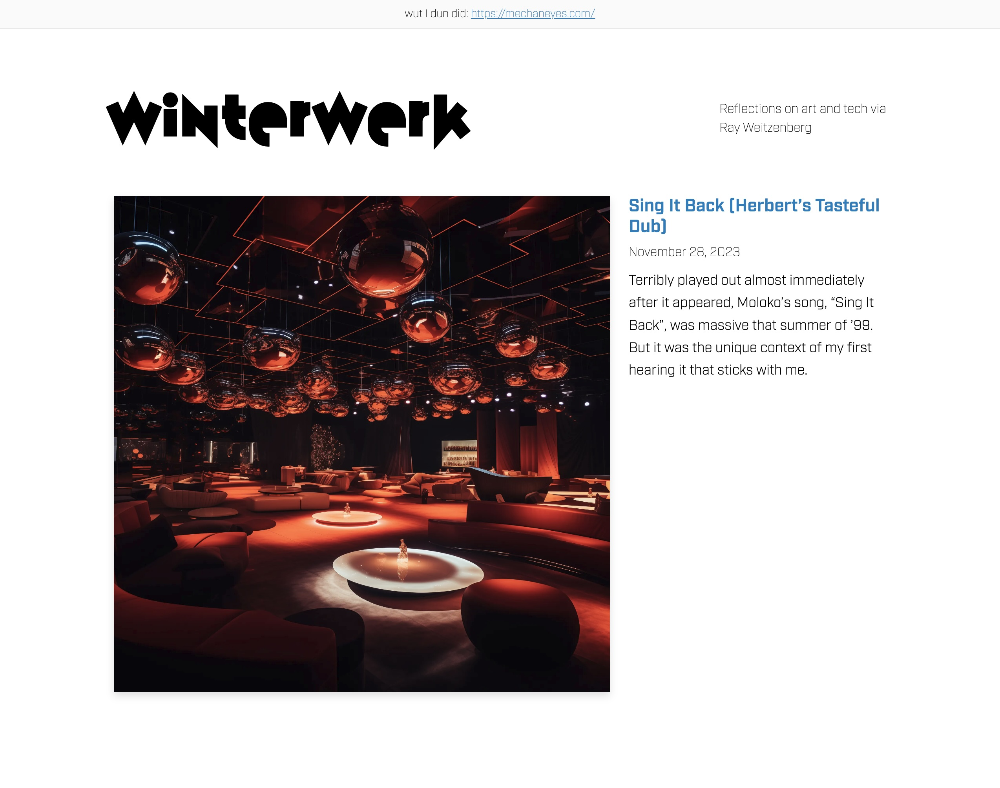

# WinterWerk

WinterWerk is primarily a personal headless WordPress blog built out via Next.js and Vercel. Several links to that documentation is immediately below.

WinterWerk also serves as a sandbox for working through some JS+Visuals ideas. Currently my experiment with horizontal scrolling is up, as is an experiment with a masonry gallery layout.

 

# Next.js v WordPress

## Using Headless WordPress with Next.js and Vercel

Headless architecture decouples your frontend and backend into separate, independently scalable pieces of infrastructure. Headless WordPress enables you to keep your existing content workflows in place while evolving your frontend for increased performance.

https://vercel.com/guides/wordpress-with-vercel

## An Incremental Static Regeneration Blog Example Using Next.js and WordPress

This example showcases Next.js's [Incremental Static Regeneration](https://nextjs.org/docs/basic-features/data-fetching/incremental-static-regeneration) feature using [WordPress](https://wordpress.org) as the data source.

 

# Mechaneyes Experiments

## Masonry Gallery Layout

### [/pages/republic/masonry.tsx](/pages/republic/masonry.tsx)

I've built out this little gallery in order to quickly expose images that I can use for raw material when working with text-to-image generative models. 

Midjourney can work with existing images placed into one's prompts. Thing is they need to live online somewhere and it's that image's URL that should be placed in the prompt.

So I've quickly hacked together this home for some images and put next to their exploded out, lightbox display, a little 'copy' icon which copies the image's URL to the clipboard when clicked.

Building this out had me working more closely than ever with GitHub Copilot. This interaction was largely fantastic. It did however break down when it came to setting up routing for the Next.js app. The only reason I wanted this up and running was to setup links to the various pages of the gallery. This aspect is still TBD.

## Horizontal Scrolling

### [/pages/republic/horizontal.tsx](/pages/republic/horizontal.tsx)

### Scroll horizontally with mouse wheel: Vanilla JavaScript
https://alvarotrigo.com/blog/scroll-horizontally-with-mouse-wheel-vanilla-java/

 
